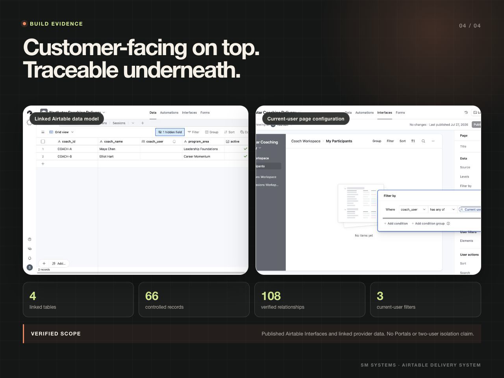
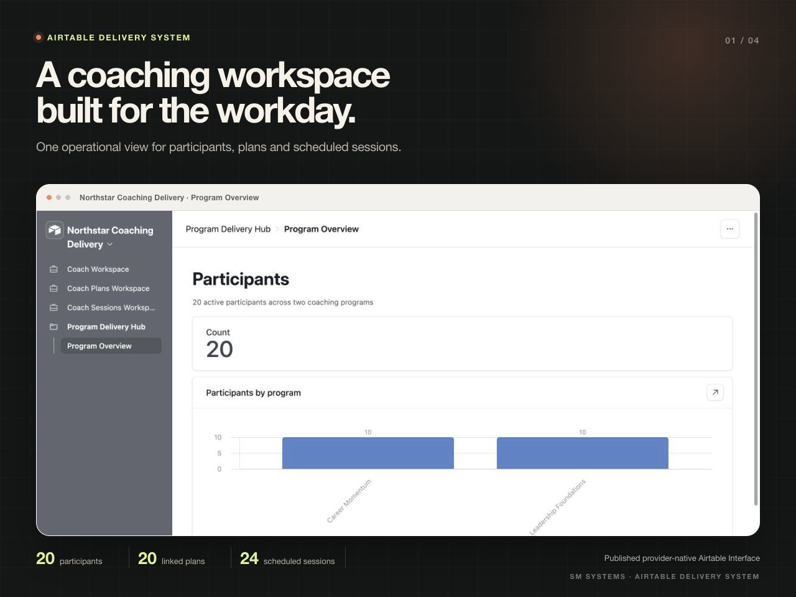
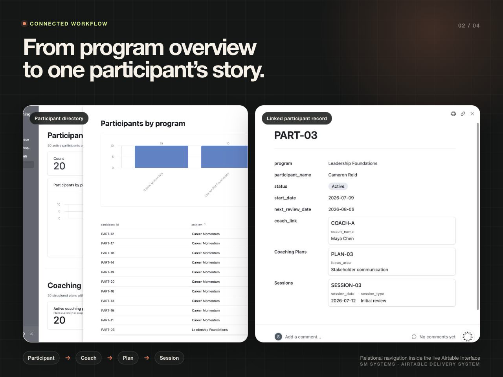
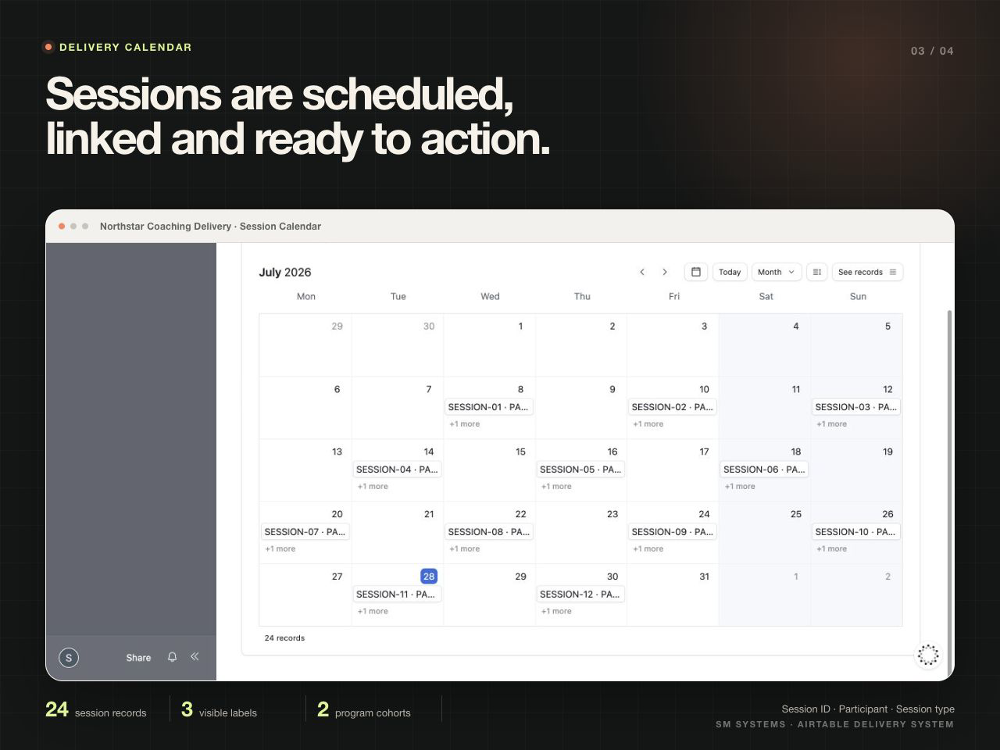

# Airtable Coaching Program Delivery Hub

An Airtable delivery workspace connecting coaches, participants, plans and scheduled sessions through a linked data model and role-specific Interfaces.

| | |
| --- | --- |
| Status | Implemented in Airtable |
| Role | Relational design, record commissioning, Interface design and user-filter configuration |
| Stack | Airtable, Airtable Interfaces |

## Delivery model

```text
Coach
  ├── Participants
  │      ├── Coaching Plan
  │      └── Sessions
  └── Current user filter
          ├── My Participants
          ├── My Coaching Plans
          └── My Sessions
```

The base contains four linked tables, 66 controlled commissioning records and 108 verified relationships:

- 2 coaches;
- 20 participants;
- 20 coaching plans;
- 24 scheduled sessions.



## Program Delivery Hub

The main Interface gives a program owner a cross-program view of active participants, linked plans, session volume and upcoming delivery.



## Participant workflow

Participant records connect the assigned coach, active plan and scheduled sessions. The detail view keeps plan and delivery context together instead of distributing it across unrelated spreadsheets.



## Session calendar

The calendar uses the linked session date and retains participant, coach, program and session-type context.



## Role-specific Interfaces

Three separate Airtable Interfaces use the provider-native condition:

```text
coach_user has any of Current user
```

The condition is configured independently for Participants, Coaching Plans and Sessions. The public contract also records the allowed editing surface: participant details are view-only, while a coach can update selected plan and session delivery fields.

No external invitation or sharing link was issued during commissioning. User assignment and multi-user access testing remain a deployment step; this repository does not describe the configuration as Airtable Portals or as completed tenant isolation.

## Validate the public model

```bash
npm run validate
```

## Repository contents

```text
assets/       selected Airtable Interface screens
contracts/    relational and Interface contracts
examples/     commissioning totals and role-filter state
scripts/      structural validator
docs/         operating and access boundaries
```

[Data and Interface architecture](docs/architecture.md)

